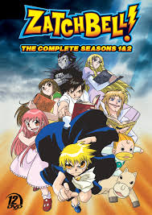

# HTML5-for-an-anime-webpage
just a trial into html5 using what I learned

<link rel="stylesheet" href="//maxcdn.bootstrapcdn.com/bootstrap/3.3.1/css/bootstrap.min.css"/>

	<h1 class="text-primary text-cen">ALL ANIMES</h1>
	<h2 class="text-primary text-cen"> Just Some Animes </h2>

Here is a list of some of the anime I got and watched in my laptop 

	<button class="btn btn-block photo-btn"><a href="D:\anime\deathnote">Death Note</a></button>
	<button class="btn btn-block photo-btn"><a href="D:\anime\ErgoProxy">Ergo proxy</a></button>
	<button class="btn btn-block photo-btn"><a href="D:\anime\durarara2">Durarara x2</a></button>
	<button class="btn btn-block photo-btn"><a href="D:\anime\TokyoRavens">Tokyo ravens</a></button>
	<button class="btn btn-block photo-btn"><a href="D:\anime\Assassination Classroom">assassination classroom</a></button>
	<button class="btn btn-block photo-btn"><a href="D:\anime\mha">my hero academia</a></button>

<form action="/search">
	<input type="search" placeholder="Enter Anime Name">
	<button class="btn btn-block btn-primary">submit</button>
<form method="get" action="http://google.com/search">
    <input type="text" name="q" required autofocus>
    <input type="submit" value="Google search">
</form>
	

	
<label><input type="radio" name="new-old">new</label>

	
<label><input type="radio" name="new-old">old</label>

	

	
  

	

	
<label><input type="checkbox" name="ser-com">serious</label>

	
<label><input type="checkbox" name="ser-com">comedy</label>

	

</form>
<table border="0" cellspacing="25">
<tr>
<td><form method="link" action="D:\anime\deathnote"><input type="submit" value="Death Note"></form></td>
<td><form method="link" action="D:\anime\ErgoProxy"><input type="submit" value="Ergo proxy"></form></td>
<td><form method="link" action="D:\anime\durarara2"><input type="submit" value="Durarara x2"></form></td>
<td><form method="link" action="D:\anime\TokyoRavens"><input type="submit" value="Tokyo ravens"></form></td>
<td><form method="link" action="D:\anime\Assassination Classroom"><input type="submit" value="assassination classroom"></form></td>
<td><form method="link" action="D:\anime\mha"><input type="submit" value="my hero academia"></form></td>
</tr>
<tr>
<td><form method="link" action="D:\anime\comedy\beelzebub"><input type="submit" value="beelzebub"></form></td>
<td><form method="link" action="D:\anime\ID jump"><input type="submit" value="idaten jump"></form></td>
<td><form method="link" action="D:\anime\zatchbell"><input type="submit" value="zatchbell"></form></td>
<td><form method="link" action="D:\anime\comedy\saiki"><input type="submit" value="saiki"></form></td>
</tr>
</table>
<h3 class="red-text"> For more anime content <a href="anime2.txt">click here</a>

<gcse:searchresults></gcse:searchresults>

